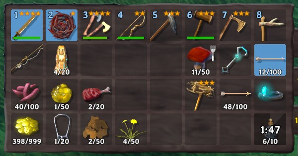
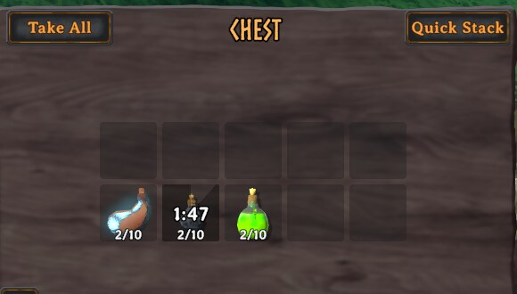
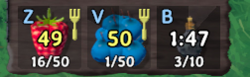

# CoolCount

A client-side Valheim mod that puts the cooldown on the item. Every mead and every food you
cannot use yet gets a **countdown and a radial sweep** on its own slot, in your inventory, in
chests and on the hotbar.

It is OmniCC for Valheim: the game already tells you a mead is running, in a small icon in the
corner, but it never tells you *which bottles in your bag that blocks*. This does, on the bottle.

Built against **Valheim 1.0.14**. Nothing to install on the server.

## Install

Drop `CoolCount.dll` into `BepInEx/plugins/`, or install through a mod manager (r2modman, Gale,
Thunderstore Mod Manager).

Requires BepInEx 5. Nothing else: no Jotunn, no server-side plugin.

## Screenshots

**In the bag.** The mead you just drank from, and how long before you can drink another.



**In the chest.** Three meads on the shelf, and only the one you cannot drink is counting down.
The frost and poison resistance beside it are in other exclusion groups, so they stay clear.



**Food and mead together.** Bound slots, with the sweep showing how much is left: two berries
most of the way to being edible again, and a mead with most of its cooldown still to run.
Yellow under a minute, white above.



## What it does

**Meads**, and anything else that applies a status effect when you consume it. The game refuses
such an item while that effect, or any effect in the same exclusion group, is still running, so
the countdown is that effect's remaining time. Drink a minor healing mead and the medium one in
your bag counts down with it, because the game blocks the whole group. Mead *bases* are left
alone: they carry the same effect for their tooltip, but you cannot drink them.

**Food** you are already digesting. Valheim lets you eat a food again once its timer drops below
half, so that is what the number counts down to. When all three food slots are full and none is
past half, every other food in the bag counts down to the moment the first slot frees up.

**Chests, carts and ships** show the same numbers, measured against your own active effects: a
mead in a chest tells you when you could drink it, not when someone could.

The overlay is drawn inside the game's own slot: a sweep that darkens the part of the cooldown
still to run and shrinks clockwise as it does, and a countdown in the game's own font, taken from the slot's stack-count label so the
face, material and outline match. Neither catches the mouse, so clicking, dragging, splitting
and hovering work exactly as before.

## Settings

`BepInEx/config/com.jumpingmushroom.coolcount.cfg`, or ConfigurationManager.

- **General** — master switch, and one toggle each for the inventory, containers, the hotbar,
  meads and food. `FoodSlotsFull` controls the countdown on foods you are not digesting.
  `MinDuration` ignores cooldowns shorter than a given length.
- **Text** — `FontSize`. `Format` is `Game` (`1:59`, matching the status icons) or `Compact`
  (`2m`, matching OmniCC). `TenthsBelow` shows `4.3` under the last few seconds. Separate
  colours for Soon, Seconds, Minutes and Hours.
- **Icon** — `Sweep` and `SweepColor` for the radial. `Dim` darkens the whole icon on top of
  the sweep; it is off by default, because doing both leaves the icon too dark to recognise,
  and knowing *which* bottle is blocked is the point.

## Console

- `coolcount` lists every item on cooldown with its remaining time and what is blocking it.
- `coolcount effects` prints your active status effects with category and remaining time, which
  is the quickest way to see which meads share an exclusion group.
- `coolcount foods` prints your active foods and when each can be eaten again.

Output also goes to the BepInEx log.

## How it decides

One file, `Core/Cooldowns.cs`, and it mirrors the game's own checks rather than guessing at
them. `Humanoid.CanConsumeItem` rejects anything that is not a Consumable, then
`Player.CanConsumeItem` rejects a consumable whose status effect, or an effect in its category,
is active, and `Player.CanEat` defers to `Food.CanEatAgain`. The overlay can therefore never
claim an item is blocked when the game would let you use it. `PLAN.md` records the decompiled
findings behind each of those.

## Building

```
./build/deploy.sh                # build and copy to the r2modman profile on the rig
./build/package.sh               # Thunderstore zip in dist/
```

Reference assemblies go in `lib/` (gitignored) or point `VALHEIM_INSTALL` at a game install.

## License

MIT.
